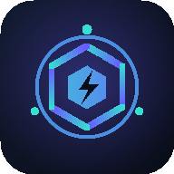

# ⚡ Aether Sentinels — Strategic Tower Defense

A complete, mobile-ready HTML5 Canvas tower defense game. Zero build step, zero
external runtime dependencies — pure vanilla JavaScript. Designed to be wrapped
into a Google Play (Android) app with [Capacitor](https://capacitorjs.com/).



---

## ✨ Features

### Six unique towers — each a distinct strategic role
| Tower | Glyph | Role |
|-------|:-----:|------|
| **Arc Coil** | ⚡ | Chain lightning — arcs between multiple enemies |
| **Cryo Node** | ❄ | Area slow field for crowd control (+ chance to freeze at max tier) |
| **Mortar** | 💥 | Splash damage — clears tightly-grouped swarms |
| **Railgun** | 🎯 | Long-range, armor-piercing single-target; bonus vs bosses |
| **Aegis Pylon** | ◈ | Support — buffs damage/fire-rate/range of nearby towers |
| **Venom Spire** | ☣ | Damage-over-time; a % max-HP poison shreds high-HP targets |

Each tower has **3 upgrade tiers** with meaningful trade-offs. Towers interact:
Pylons buff neighbours, Cryo sets up Mortar splashes, Venom melts what Railguns
soften. Winning requires a *combination*, not spamming one type.

### Strategic enemies
Drones, fast Runners, armored Brutes, high-armor Wardens, splitting Spawnlings,
**Menders** that heal allies, and **Phantoms** that can dodge shots — each
demands a different counter.

### Boss levels & animations
Every map ends in a **boss wave**: the **Aether Titan**, the **Hive Mind**
(continuously spawns minions), and the regenerating **Void Colossus**. Bosses
have damage resistance, so single-strategy defenses fail. Full particle system:
muzzle sparks, chain-lightning beams, explosions, freeze/poison overlays, screen
shake, floating damage numbers, and procedural WebAudio sound (no audio files).

### 4 hand-designed maps
Verdant Pass (Easy) → Frost Canyon (Normal) → Ember Foundry (Hard) →
Void Nexus (Extreme). Each has a unique winding path and build-node layout.
Progress, unlocks, and star ratings are saved to `localStorage`.

### Heroes & weapon fusion
Deploy **soldier heroes** anywhere on the battlefield (free placement, not tied to
build nodes). Each carries a detailed, animated weapon — muzzle flashes, ejected
shell casings, tracer rounds, recoil kickback, and distinct procedural gun audio.

**Drag one hero onto another of the same weapon to fuse them** into the next weapon
up the ladder:

`Pistol → SMG → Assault Rifle → Sniper Rifle → Minigun → Rocket Launcher`

Each fusion is a bigger, deadlier gun: the SMG sprays bursts, the rifle is a solid
automatic, the sniper is armor-piercing hitscan, the minigun has spinning barrels,
and the Rocket Launcher fires explosive splash rounds. Heroes can be tapped to set
their targeting priority or sold. This adds an active, hands-on layer on top of the
static tower defense — position your squad and merge on the fly.

### Targeting priorities
Every attacking tower can be set to target **First** (closest to core), **Last**
(earliest on path), **Strongest** (highest HP — great for bosses), or **Closest**
(nearest to the tower). Tap a tower to change its mode — a core layer of control.

### Active abilities
Two tactical abilities on cooldown, mapped to on-screen buttons:
- ☄ **Orbital Strike** — tap to arm, then tap the map to drop a massive true-damage
  blast (ignores armor/resist). 25s cooldown.
- ❄ **Cryo Pulse** — instantly freezes every enemy on the map for 3s. 40s cooldown.

These let you answer a boss rush or a leak emergency with skill, not just economy.

### Settings
A settings screen with a sound on/off toggle and a volume slider, both persisted
to `localStorage` and applied live.

### Mobile-first
Touch + mouse controls, responsive canvas that fits any screen, fullscreen
landscape PWA manifest, a parallax starfield, dramatic boss intro animations,
and a full menu / level-select / how-to-play / settings / results UI.

---

## ▶️ Play it now (browser)

No install needed. Serve the folder over HTTP (audio & localStorage need a real origin):

```bash
npm run serve      # -> http://localhost:8080
# or:  python3 -m http.server 8080
```

Open the URL, tap **Campaign**, pick a map, place towers on the hex (⬡) nodes,
and press **Start Wave**.

> Opening `index.html` directly via `file://` mostly works, but a local server
> is recommended so the audio context and save system behave correctly.

---

## 📁 Project structure

```
.
├── index.html               # App shell (HUD, tray, panels, screens)
├── css/style.css            # All styling
├── js/
│   ├── utils.js             # Math helpers + localStorage save system
│   ├── data.js              # Towers, enemies, maps, wave generation
│   ├── audio.js             # Procedural WebAudio sound effects
│   ├── particles.js         # Particle system + floating text
│   ├── entities.js          # Enemy, Projectile, Tower classes & mechanics
│   ├── game.js              # Engine: loop, grid, waves, rendering
│   ├── ui.js                # DOM UI: HUD, tray, inspect panel, level select
│   └── main.js              # Bootstrap, screen routing, touch/mouse input
├── assets/
│   ├── icon.svg             # Source app icon
│   ├── icon-192.png         # Generated launcher icons
│   ├── icon-512.png
│   └── gen-icons.js         # Regenerate the PNG icons (Node built-ins only)
├── manifest.webmanifest     # PWA manifest
├── capacitor.config.json    # Capacitor / Android config
└── package.json
```

---

## 🎮 How to play

1. **Build** — tap a tower card in the bottom tray, then tap a hex node (⬡) to place it.
   The card stays selected so you can place several; tap it again to deselect.
2. **Upgrade / Target / Sell** — tap a placed tower to open its panel. Upgrade through
   3 tiers, change its **targeting priority** (First/Last/Strongest/Closest), or sell
   it back for 60% of its cost.
2b. **Abilities** — tap ☄ then tap the map for an Orbital Strike; tap ❄ for a
    map-wide Cryo Pulse. Both are on cooldown (shown on the buttons).
3. **Start Wave** — press the button to summon the next wave. Between waves you have
   time to build and upgrade. Clearing a wave grants bonus gold.
4. **Survive** — every enemy that reaches your Core costs a life (bosses cost 10).
   Clear all waves, including the boss, to win the map and unlock the next.
5. **Speed / Pause** — use the HUD buttons to fast-forward (1x/2x/3x) or pause.

**Star rating:** 3★ = finish at full lives, 2★ = ≥50% lives, 1★ = survive.

---

## 📦 Packaging for Google Play (Android via Capacitor)

The web game is the source of truth; Capacitor wraps it in a native Android
shell that produces the `.aab` bundle Google Play requires.

### Prerequisites
- Node.js 18+ and npm
- **Android Studio** (installs the Android SDK + JDK)
- A [Google Play Console](https://play.google.com/console) developer account
  (one-time US$25 registration) to publish

### Steps

```bash
# 1. Install Capacitor tooling
npm install

# 2. Initialize the native Android project (reads capacitor.config.json)
npm run cap:add          # npx cap add android

# 3. Copy the web assets into the native project
npm run cap:sync         # npx cap sync android

# 4. Open in Android Studio to set icons, run on a device/emulator
npm run cap:open         # npx cap open android
```

In Android Studio you can run the app on an emulator/device immediately.
To ship to Play:

```bash
# Build a release Android App Bundle (.aab)
npm run android:bundle   # -> android/app/build/outputs/bundle/release/app-release.aab
```

Before uploading you must:
1. **Generate a signing key** and configure `android/app/build.gradle`
   (`signingConfigs`) — see Android's
   [app signing guide](https://developer.android.com/studio/publish/app-signing).
2. Set launcher icons from `assets/icon-512.png` (Android Studio → *Image Asset*),
   or drop the generated PNGs into the `res/mipmap-*` folders.
3. In the Play Console: create the app, complete the store listing, content
   rating, data-safety form, upload the signed `.aab`, and roll out to a testing
   track first, then production.

> **Note:** publishing to the Play Store itself (account, signing keys, store
> listing, review) is a manual process only you can complete — those steps can't
> be automated from here. Everything up to producing the signed `.aab` is scripted above.

### Alternative wrappers
- **PWA / TWA (Trusted Web Activity)** via [Bubblewrap](https://github.com/GoogleChromeLabs/bubblewrap)
  — since a valid `manifest.webmanifest` is included, you can also publish this as
  an installable PWA and wrap it as a TWA.
- **Apache Cordova** works too; point `www` at this folder.

---

## 🔧 Regenerating icons

The launcher icons are generated from scratch with Node built-ins (no image libs):

```bash
node assets/gen-icons.js   # rewrites assets/icon-192.png and icon-512.png
```

---

## ⚖️ License

MIT — do whatever you like. Attribution appreciated but not required.
